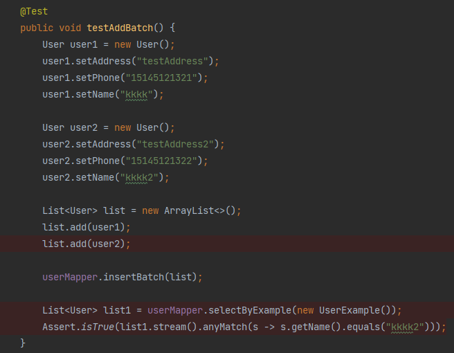

## 基于springboot实现数据库的加解密

### 功能说明

* 支持使用注解的方式目标类进行加解密
* 支持同一个类多个字段分别使用不同的加密方式
* 支持自定义加密方法

### 本地调试
* pull代码到本地，更换application.yml中的数据库用户名和密码，执行user.sql
* 执行单元测试TestEncryption.class

### 测试效果




### 引入方式
* pull代码到本地，mvn install
* 引入pom文件
```xml
<dependency>
    <groupId>org.spring-ibatis.encrypt</groupId>
    <artifactId>encryption-core</artifactId>
    <version>1.0</version>
</dependency>
```
* 对需要加密的类添加注解，eg：
``` java
@SensitiveData
public class User {

    private Long id;

    @AesSensitiveField
    private String name;

    @Base64SensitiveField
    private String phone;

    @AesSensitiveField
    private String address;
}
```
* 添加包扫描
``` java
  @MapperScan({"encryption"});
 ```
